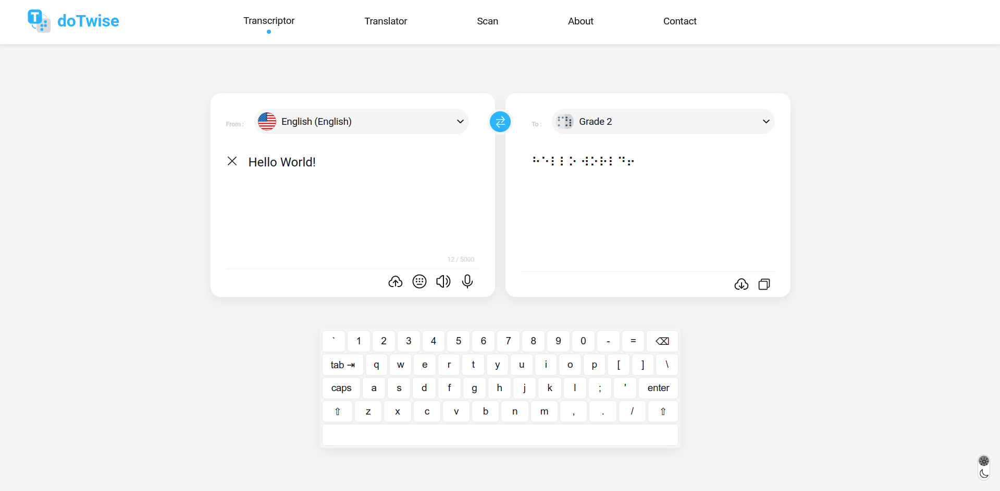

# Braille Transcription Tool

This is a simple tool for converting text to and from braille. It provides a web interface where users can input text and choose a language and grade for transcription.

###### Light Mode

###### Dark Mode

## Installation

To run this project locally, follow these steps:

1. Clone this repository.
2. Read [README](backend/README.md) for backend
3. Read [README](frontend/README.md) for frontend

## Usage

Once the servers are running, navigate to `http://localhost:3000` in your browser to access the web interface. Input your text and select a language and grade, then click the "Translate" button to see the result in braille.

You can also upload an image containing text and have it transcribed to braille. Click the "Choose File" button and select an image, then click the "Upload" button. The transcribed text will be displayed on the screen.

## Backend

The backend is a Python server built with FastAPI. It provides many endpoints like:

- `/transcriptor`: Accepts text input and language/grade parameters, and returns the corresponding braille output.
- `/uploadfile`: Accepts an image file and returns the text transcribed to braille.

The server uses Tesseract OCR to extract text from the image, and then passes the text to the `BrailleTranscriptor` class for transcription.

## Frontend

The frontend is a React application built with Create React App. It provides a simple interface for inputting text and selecting a language and grade. It also allows users to upload an image for transcription.

The application uses the `axios` library to communicate with the backend server.

## Contributing

Contributions are welcome! Please see the [CONTRIBUTING](CONTRIBUTING.md) file for more information.

## License

This project is licensed under the MIT License. See the [LICENSE](LICENSE) file for details.

