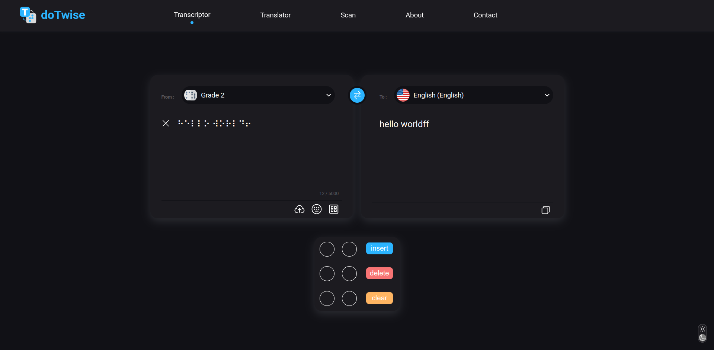

# DotWise

DotWise is a web application that provides a bidirectional Braille translation with multiple languages, voice speech, voice speech recognition, text/braille keyboard, Braille board, black text image recognition, and on Braille text field, you can write in Braille using the keys s d f j k l corresponding number 3 2 1 4 5 6 in the dot cell position, dark mode, mobile version, and more.

##### Light Mode

##### Dark Mode

## Features

- Bidirectional Braille translation with multiple languages.
- Auto-detect language feature.
- Voice speech and voice speech recognition.
- Text/Braille keyboard.
- Braille board.
- Black text image recognition.
- Braille text field where you can write in Braille using the keys s d f j k l corresponding number 3 2 1 4 5 6 in the dot cell position.
- Dark mode.
- Mobile version.

## Installation

- Clone the repository using `git clone https://github.com/JamelSyh/braille-translator.git`
- Install yarn if you do not already have it installed `npm i --global yarn --save`(or you can use `npm i` and `npm start`)
- go to the project root directory `cd braille_project/frontend/braille-translator`
- Install dependencies using `yarn install`
- Run the app using `yarn start`

## Contributing

Contributions are welcome! If you have any suggestions, bug reports, or feature requests, please open an issue or a pull request on this repository.

